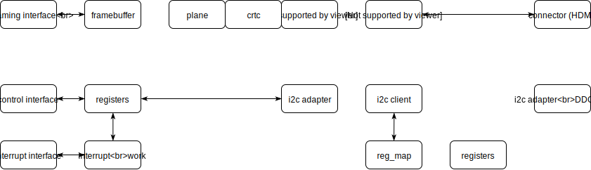

# Linux kernel FL2000DX/IT66121FN dongle DRM driver

Clean re-implementation of FrescoLogic FL2000DX DRM driver and ITE Tech IT66121F driver, allowing to enable full display controller capabilities for [USB-to-HDMI dongle based on such chips](https://www.aliexpress.com/item/HD-1080P-USB-3-0-To-HDMI-External-Video-Graphic-Card-Multi-Display-Cable-Adapter-Converter/32808836824.html?spm=a2g0s.9042311.0.0.4a9f4c4dow19O6) in Linux

## FL2000DX
The FL2000DX is Fresco Logic’s USB 3.0 Display device controller. It integrates Fresco Logic’s display transfer engine, USB 3.0 device controller, USB 3.0 transceiver, and a VGA (D-Sub) DAC. Fresco Logic’s display transfer engine is designed with Fresco Logic’s proprietary architecture and processes the video stream optimally for USB 3.0 bandwidth. The high performance video DAC provides clear and crisp display quality, and supports full HD (1920×1080) resolution. The integrated USB 3.0 device controller and transceiver were developed in conjunction with the de-facto standard Fresco USB 3.0 host controllers, which ensures the best performance and compatibility.

## IT66121FN
The IT66121 is a high-performance and low-power single channel HDMI transmitter, fully compliant with HDMI 1.3a, HDCP 1.2 and backward compatible to DVI 1.0 specifications. IT66121 also provide the HDMI1.4 3D feature, which enables direct 3D displays through an HDMI link. The IT66121 serves to provide the most cost-effective HDMI solution for DTV-ready consumer electronics such as set-top boxes, DVD players and A/V receivers, as well as DTV-enriched PC products such as notebooks and desktops, without compromising the performance. Its backward compatibility to DVI standard allows connectivity to myriad video displays such as LCD and CRT monitors, in addition to the ever-so-flourishing Flat Panel TVs.

## Implementation

## Limitations
 * USB2.0 is not supported
 * Connecting more than one dongles to the same bus is not supported
 * VGA (D-Sub) DAC output of FL2000DX is not supported
 * HDMI CEC is not supported
 * HDMI Audio is not supported
 * HDCP is not supported
 * Internal SPI flash access is not supported
 * Only big-endian hosts are supported
 * 32-bit hosts are not supported

## Upstreaming
This is not going to happen - both chips are poorly supported by their vendors in the Linux world, if at all.
Also there are some hacks on HDMI transmitter autodetection ;)

## Sources
 * Original driver by FrescoLogic: https://github.com/FrescoLogic/FL2000
 * Major clean-up of original FL driver by Hans Ulli Kroll: https://github.com/ulli-kroll/FL2000
 * Reference IT66121FN driver ftom RK3188 Android KK kernel repositpry: https://github.com/phjanderson/Kernel-3188
 * Reference USB DRM implementation of DisplayLink driver (see drivers/gpu/drm/udl)
 * Reference simple DRM implementation of PL111 driver (see drivers/gpu/drm/pl111)

## Notes
 * We can use simple DRM display pipeline (only prime plane -> crtc -> only one encoder)
 * FL2000DX outputs DPI interface (kind of "crtc" output, not "encoder")
 * IT66121 can be implemented as a DRM bridge
 * Register address for IT66121 can be done via regmap (see <linux/regmap.h>)
 * For registration of sibling I2C devices of IT66121 (CEC, DDC, ...) i2c\_new\_dummy() function may be used

## Open questions
 * Can FL2000DX support USB Bulk Streams?
 * How many planes are there in FL2000DX?
 * Any additional pixel formats for FL2000DX except ones in original drivers?
 * Any need in pixel format modifiers for FL2000DX?
 * Any chance to use regmap for FL2000DX?
